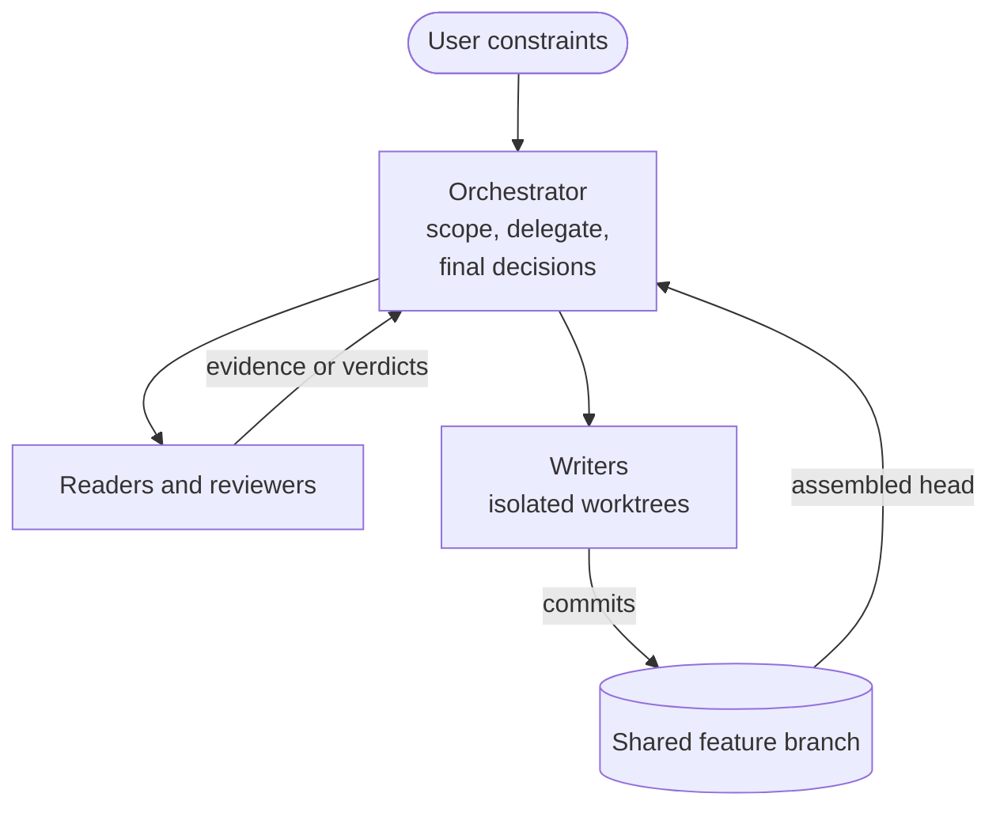
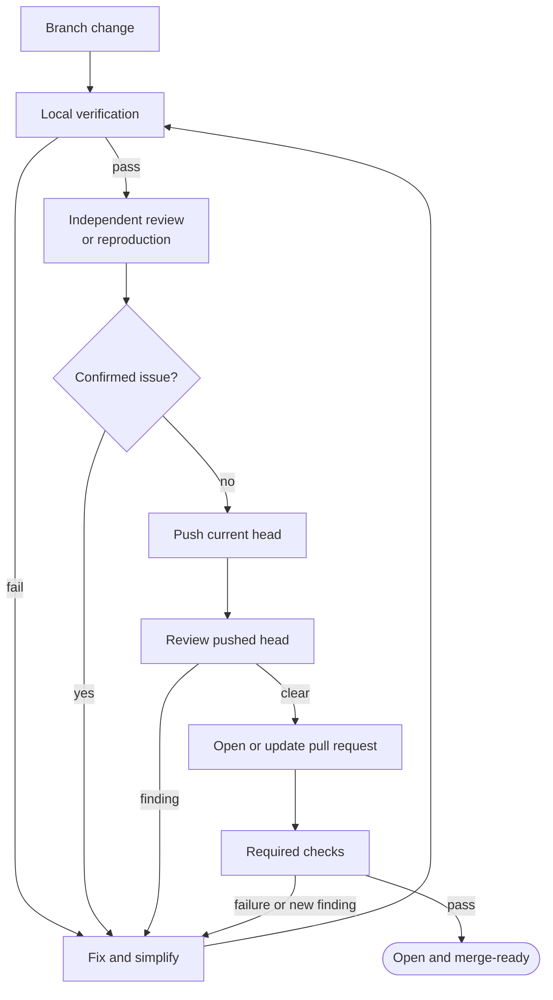

# Long-horizon engineering with Claude Code

The wake-rs audit and rebuild used one interactive Claude Code session as the
orchestrator. It delegated bounded work while retaining scope, GitHub writes,
and final decisions. Evidence, tests, and CI - not agent confidence - defined
done.

## Delegation

The accepted path used two worker roles. Readers and reviewers returned
evidence or verdicts. Writers produced commits in isolated worktrees. Those
commits reached the feature branch by automatic fast-forward or orchestrator
cherry-pick, and the assembled head was reviewed before publication.

Direct `Agent` calls handled one bounded task. Scripted `Workflow` runs handled
repeatable coordination: `parallel()` ran independent audits or reviews at
once, while `pipeline()` moved each item through dependent stages as soon as
its previous stage finished. Interrupted workflows could reuse completed agent
calls; changed inputs or repository heads started fresh runs.

## From change to merge-ready

Writer output was not sufficient for merge readiness. Local evidence,
independent review, and a final review of the pushed head drove the correction
loop.

Verification escalated from pure logic and fakes to native smoke tests, then to
the smallest privileged test needed to close a remaining gap. High-risk or
disputed findings were checked in a fresh context or reproduced.

Required evidence included signed commits; formatting, clippy, MSRV, tests,
release builds, and native smoke on Linux, macOS, and Windows; RustSec; and the
external GitGuardian check. Every required pull-request check passed. Tag-only
release jobs were skipped by design, and the pull request remained unmerged.

## Model routing

Claude Code remained the interface and orchestrator.
[`claude-code-codex`](https://github.com/Bug-Finderr/claude-code-codex) (`ccx`)
routed `gpt-5.6-sol` as both the main model and the inherited model for ordinary
`Agent` calls. Routing happened beneath the Agent tool interface, so identical
calls could run on different models without changing the orchestration.
Explicit Workflow tasks used Sonnet and Fable for selected research and review
stages. Explicit Agent calls used Fable and Opus, including the Windows security
review; ordinary implementation calls inherited `gpt-5.6-sol` through `ccx`.
Model choice changed the worker, not the topology or evidence standard.

The reusable pattern is simple: delegate independent work, isolate writers,
review the assembled result outside the writing context, and keep one
orchestrator accountable for integration.
