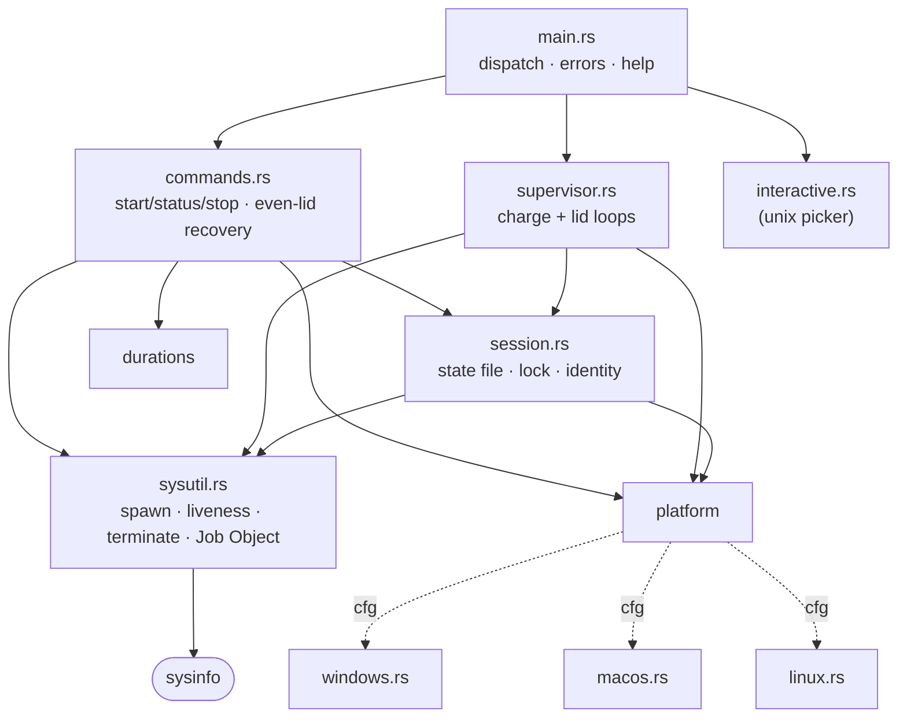
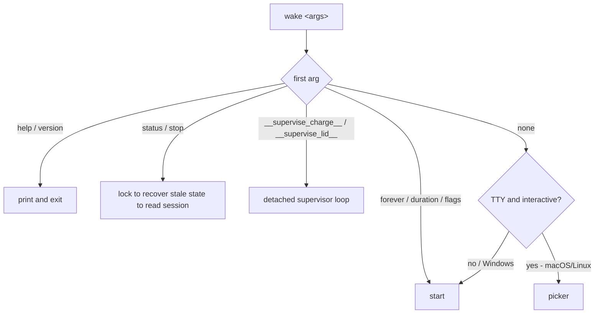
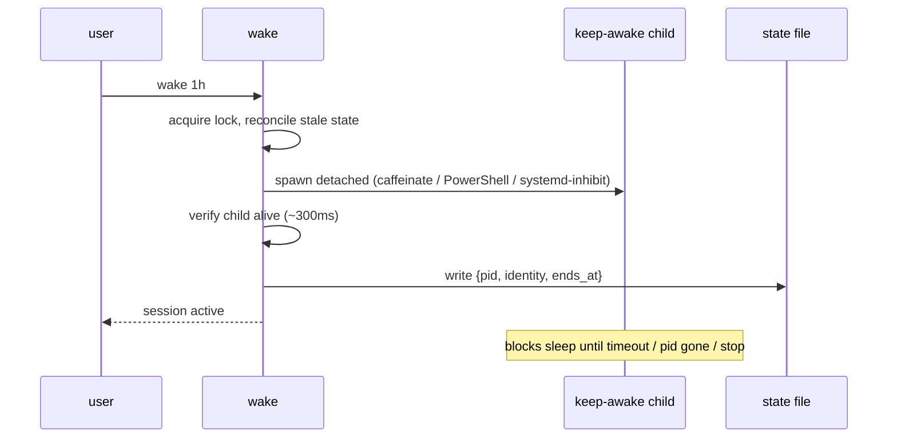
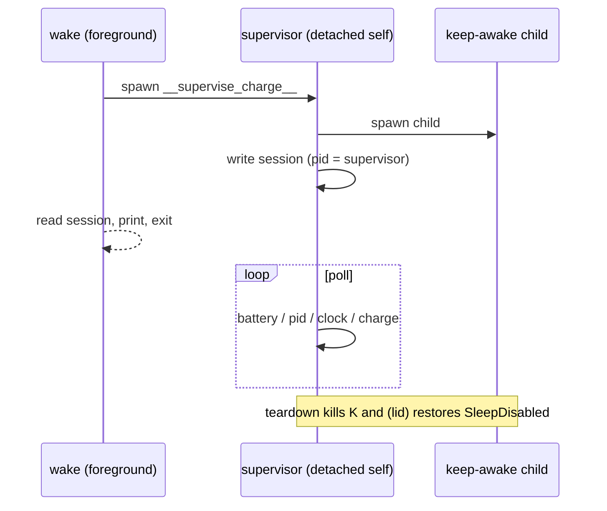

# Architecture

`wake` is a single binary with no daemon. It drives the OS's native sleep-inhibition tool, records a
session in a state file, and reconciles that state on every invocation.

## Modules

`platform` is a trait-free abstraction: each OS module exposes the same free functions, selected at
compile time by `cfg` and re-exported from `platform/mod.rs`. Even-lid functions are real on macOS and
unsupported stubs elsewhere.

## Command dispatch

## Session lifecycle

A session is the OS sleep-inhibitor process plus a `session.properties` record. The record stores the
pid **and** a process-identity fingerprint (start time, exe, command line); every read verifies the pid
is still that same live process before trusting it, so a recycled pid never looks like a live session.

## Supervisors

`--until-charge` (all OSes) and `--even-lid` (macOS) need a process that outlives the foreground
command, so `wake` spawns a detached copy of itself (`__supervise_*`). The supervisor owns the
keep-awake child and polls until its condition is met. The recorded session pid is the supervisor.

Teardown must survive a forcible `wake stop`:

- **Windows** — the child is placed in a kill-on-close Job Object; when `stop` calls `TerminateProcess`
  on the supervisor, the job closes and the OS kills the child. No orphan keeps the machine awake.
- **Unix** — the supervisor installs a SIGTERM/SIGINT flag that breaks its poll loop into the normal
  cleanup path; `stop` also re-verifies and restores macOS `SleepDisabled` as a safety net.

## Key decisions

- **No `dyn`/trait objects** for platforms — `cfg`-selected free functions; only the target OS compiles.
- **Process identity over bare pid** — guards against pid reuse without a daemon.
- **Native `std::fs` file locking** (Rust 1.89+) instead of a crate.
- **Shell out to platform tools**, exactly as the original, passing values as argv (never a shell
  string) so app/pid names can't inject commands. The one generated script (Windows PowerShell) embeds
  only validated numerics and a base64-encoded body.
- Minimal `unsafe`: confined to `sysutil.rs` for the Windows Job Object and clearing handle
  inheritance, via `windows-sys`.
