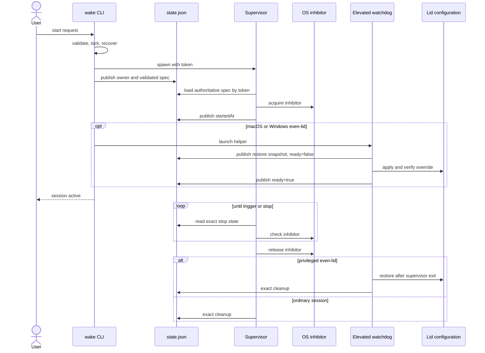
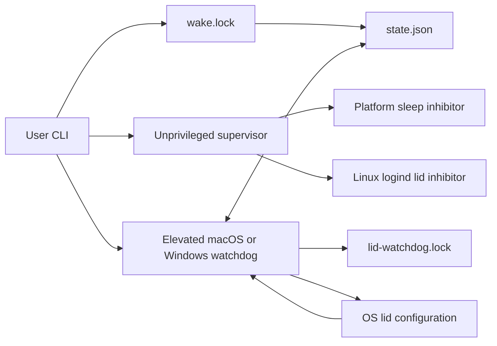

# Architecture

## Overview and invariants

`wake` is one binary with no installed service. A foreground CLI validates and records one session, then a detached supervisor owns the platform sleep inhibitor until its trigger completes or a stop is requested. macOS and Windows add an elevated watchdog only for closed-lid operation. Linux handles the lid through the supervisor's logind inhibitor.

The lifecycle keeps these invariants:

- At most one session exists in a state directory.
- `wake.lock` serializes recovery and every state transition.
- A random token plus PID and native process creation value identifies each owner.
- Owner and run specification are immutable; the stop bit changes only from false to true.
- Reads validate the complete schema. Cleanup removes only an exact state snapshot.
- Privileged restoration is verified before recovery state is removed.

## Module boundaries

- `main.rs` dispatches public commands and private helpers.
- `commands.rs` parses requests, runs recovery, and hands ownership to the supervisor.
- `durations.rs` and `run.rs` validate duration, trigger, mode, and tracked-process semantics.
- `session.rs` owns strict serialization, private paths, atomic replacement, and both OS locks.
- `supervisor.rs` owns the inhibitor and evaluates the stop bit, trigger, and process identity.
- `lid.rs` coordinates elevated watchdog startup, conditional restoration, and recovery.
- `platform/` contains the compile-time macOS, Linux, and Windows implementations.
- `sysutil.rs` owns detached process creation, native process identity, and Windows elevation handles.

## Lifecycle

```mermaid
sequenceDiagram
    actor User
    participant CLI as wake CLI
    participant State as state.json
    participant Supervisor
    participant OS as OS inhibitor
    participant Watchdog as Elevated watchdog
    participant Lid as Lid configuration
    User->>CLI: start request
    CLI->>CLI: validate, lock, recover
    CLI->>Supervisor: spawn with token
    CLI->>State: publish owner and validated spec
    Supervisor->>State: load authoritative spec by token
    Supervisor->>OS: acquire inhibitor
    Supervisor->>State: publish startedAt
    opt macOS or Windows even-lid
        CLI->>Watchdog: launch helper
        Watchdog->>State: publish restore snapshot, ready=false
        Watchdog->>Lid: apply and verify override
        Watchdog->>State: publish ready=true
    end
    CLI-->>User: session active
    loop until trigger or stop
        Supervisor->>State: read exact stop state
        Supervisor->>OS: check inhibitor
    end
    Supervisor->>OS: release inhibitor
    alt privileged even-lid
        Watchdog->>Lid: restore after supervisor exit
        Watchdog->>State: exact cleanup
    else ordinary session
        Supervisor->>State: exact cleanup
    end
```

The foreground holds `wake.lock` while it spawns the supervisor with only a random token, captures the child's native identity, and atomically publishes the starting snapshot. The child blocks on that lock, then loads `state.json` as the sole run-specification authority and verifies the token and its own native identity. It acquires the inhibitor and publishes its start time before the foreground reports success.

The supervisor polls once per second. Timed triggers use monotonic elapsed time; local clock deadlines use wall time. Battery checks run every 30 seconds. PID and app triggers observe a process but never terminate it. A stop command sets the exact owner's stop bit and waits for that owner to exit instead of signaling a persisted PID.

## Durable state

`state.json` is the one authoritative snapshot. It contains the schema version, immutable owner and run specification, start time, note, stop bit, and optional lid restoration record. Unknown fields, invalid identities, impossible transitions, and a lid record on Linux are rejected.

One atomic JSON document fits this state because callers need the latest mutually consistent snapshot, not an event history. JSONL would require replay, torn-tail handling, compaction, and cross-record invariant checks without adding useful product behavior. A same-directory temporary file is written privately, synced, and atomically replaced. Unix then syncs the parent directory and uses mode `0700` for the directory and `0600` for state and lock files. Windows requires a protected directory DACL and full control only for the caller, SYSTEM, and Administrators. Replacement of an existing Windows state file uses a random transient backup; documented partial-replacement outcomes are reconciled to a validated canonical file or leave the recoverable copies named in the error.

`wake.lock` is the writer lock. `lid-watchdog.lock` is permanent and proves elevated watchdog lifetime through an OS-held exclusive lock. Recovery checks the watchdog lock without blocking while it holds the writer lock. After acquiring the writer lock, lifecycle commands reject recognized legacy formats and incomplete atomic-write artifacts instead of ignoring or mixing them with current state.

## Privilege boundary

```mermaid
flowchart LR
    User["User CLI"] --> Lock["wake.lock"]
    Lock --> State["state.json"]
    User --> Supervisor["Unprivileged supervisor"]
    User --> Watchdog["Elevated macOS or Windows watchdog"]
    Supervisor --> Native["Platform sleep inhibitor"]
    Supervisor --> Linux["Linux logind lid inhibitor"]
    Watchdog <--> State
    Watchdog --> WatchLock["lid-watchdog.lock"]
    Watchdog --> Config["OS lid configuration"]
    Config --> Watchdog
```

The ordinary supervisor is unprivileged on every platform. Helper arguments are fixed argument vectors or encoded values, never shell commands.

On macOS, the watchdog runs through `sudo`. Before authentication, wake canonicalizes its executable and rejects the executable or any ancestor that is not root-owned, has an extended ACL, or can be changed by a non-root caller. The helper also requires the state directory and files to remain owned by the sudo caller, free of extended ACLs, and set to modes `0700` and `0600`.

On Windows, the watchdog runs through UAC. It receives the caller SID and absolute state directory, rejects elevation as a different account, and revalidates the owner and exact protected DACL before reading state. The DACL admits only the caller, SYSTEM, and Administrators with full control.

The watchdog records the pre-mutation setting before its first OS write, verifies the override, and marks itself ready. Restoration rereads the setting and writes only fields that still contain wake's override at that read. This is best-effort rather than atomic: another actor can change a field between the read and write. Windows also checks that the recorded power scheme is still active before applying restored values, but a scheme switch during that check-and-apply interval can be reversed by the apply call.

Linux uses no privileged helper. Explicit closed-lid operation requires the strongest logind candidate containing `handle-lid-switch`; failure does not fall back to a weaker inhibitor.

## Recovery and security

Every public lifecycle command checks for legacy state and runs recovery before acting. A live native process identity preserves its session. Dead ordinary state is removed under the writer lock. Stale lid state first requests owner shutdown, then restores and verifies the recorded platform values while holding the watchdog lock, and finally performs exact deletion.

The watchdog also retains its snapshot in memory. If durable state becomes missing, malformed, or mismatched during teardown, it can still restore wake-owned values but permanently gives up deletion authority. Restoration failure keeps the durable record for a later retry.

Process liveness never trusts a PID alone. Linux uses process start ticks, macOS uses the BSD process start timestamp, and Windows uses the process creation `FILETIME`. Depending on the lifecycle path, inspection errors are propagated or retried during a bounded wait; they never count as process death.

The state directory and final state and lock files reject symbolic links or Windows reparse points. Writes use random, exclusively created temporary names. Strict parsing and exact-owner transitions make malformed or conflicting state an error instead of a cleanup target.

## Platform constraints

- macOS requires `/usr/bin/caffeinate` for ordinary inhibition. Closed-lid operation also requires `/usr/bin/pmset`, an interactive sudo authentication, and a protected root-owned installation.
- Linux requires `systemd-inhibit`, GNU `tail` with `--pid` support, and systemd-logind. Normal sessions may use weaker candidates without lid handling when stronger locks are unavailable. Explicit closed-lid sessions have no fallback and cover only lid events handled by logind, not firmware or unrelated suspend paths.
- Windows uses native power requests. Closed-lid operation requires same-account administrator elevation and reads and changes AC/DC lid actions in the active power scheme.

## Verification boundaries

Unit tests cover strict parsing, transition rules, recovery decisions, process identities, and pure restoration plans. Linux and Windows smoke tests use isolated state directories; the Linux smoke test replaces `systemd-inhibit` with a local fake to exercise strict even-lid selection, ordinary fallback, and denial handling. macOS CI exercises ordinary inhibition and verifies that an unprotected CI binary is refused before elevation.

A Linux container can run the Linux binary and fake-inhibitor smoke coverage. It cannot provide a macOS kernel or macOS power APIs. Apple target checks prove conditional compilation only; native macOS CI remains the runtime check. Automated tests do not close a physical lid or mutate real lid settings, so those hardware and privilege paths require controlled manual testing.
